# Prototipo para analisis y seguimientos de pacientes

El presente proyecto tiene como objetivo mejorar el seguimiento continuo de los pacientes en el programa médico “Salud Latina sin Medicina”. 
Dicho proyecto abarca el desarrollo de una aplicación web en Streamlit que incluye el registro de pacientes, almacenamiento de historial médico, búsqueda de información básica de pacientes, anotación de notas de progreso de paciente y notas de observaciones de avances en el paciente por parte del especialista a cargo y visualizaciones de gráficas acorde al progreso.  El valor agregado de este proyecto radica en la eficiencia de la gestión de pacientes, el seguimiento oportuno al programa y la promoción de la salud a través de la tecnología.

**Autores:** 
Universitarios de la carrera de Ingeniería en Datos e Inteligencia Organizacional, Cancún, Quintana Roo:
* Dolores Amayrani Gómez Hernández
* Karla Guadalupe Salinas Guinto
* Adolfo Tun Dzul

## 1. Inicio de sesión

  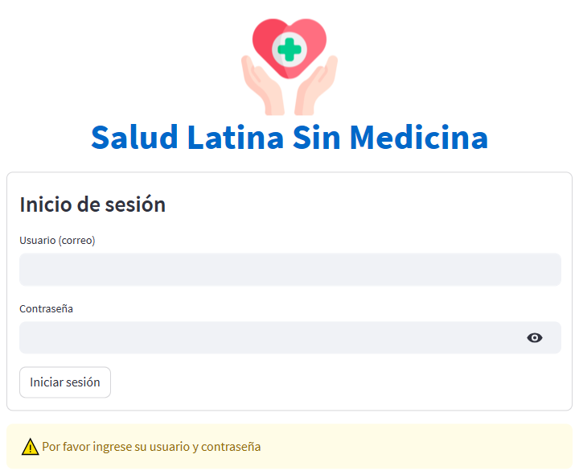   
  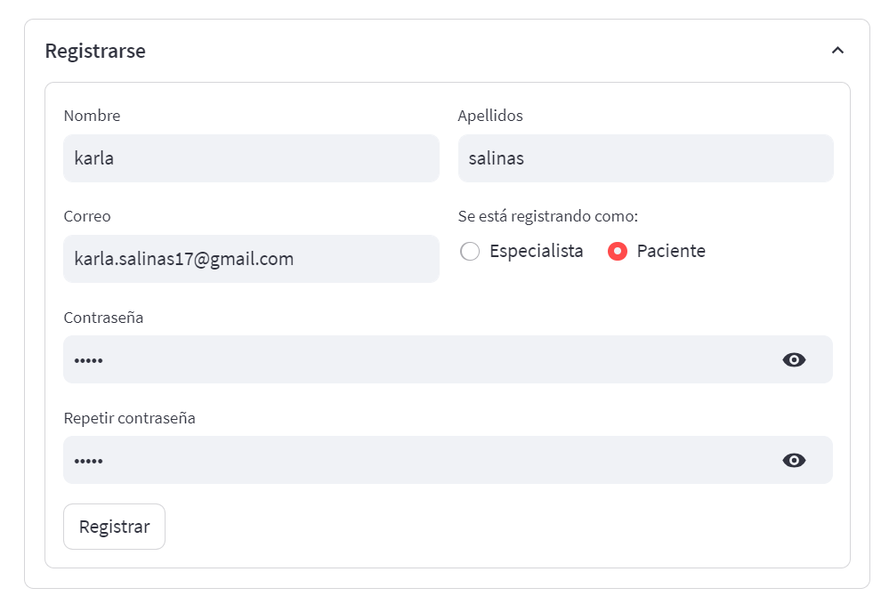   
  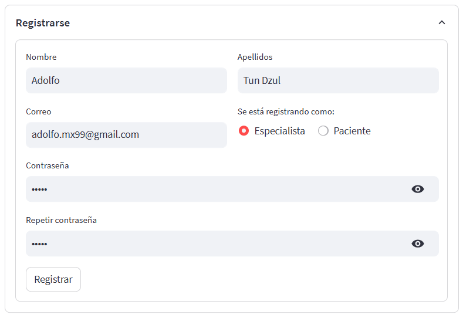   

## 2. Interfaz paciente

  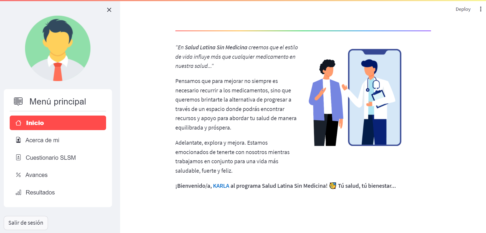   
  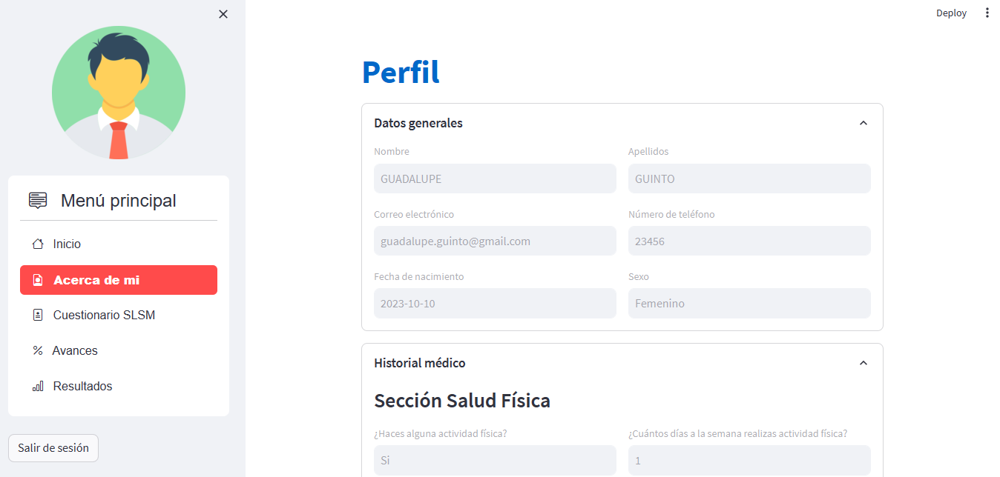   
  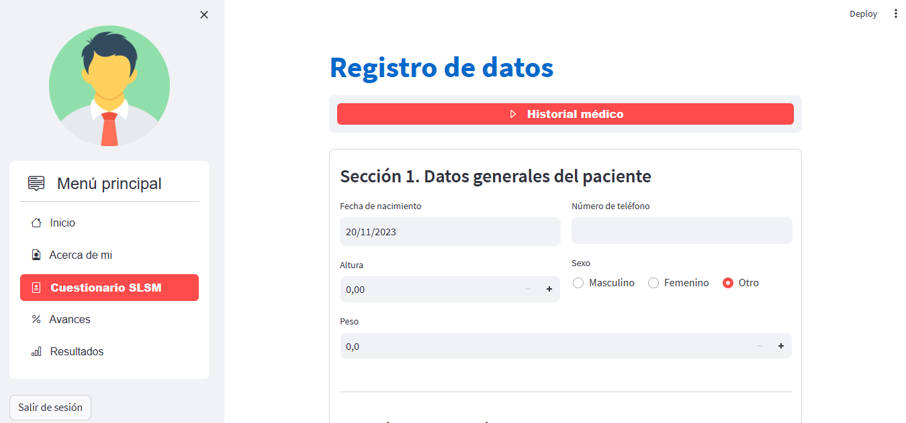   
  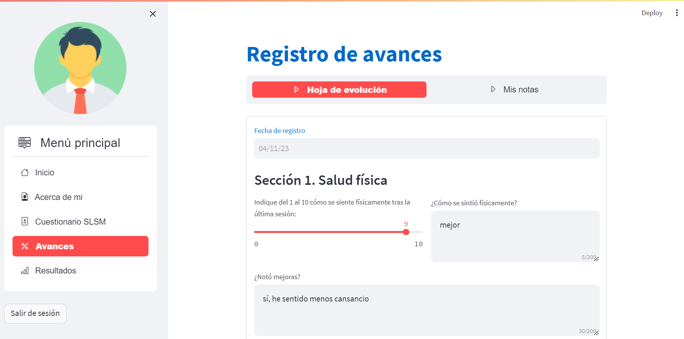   
  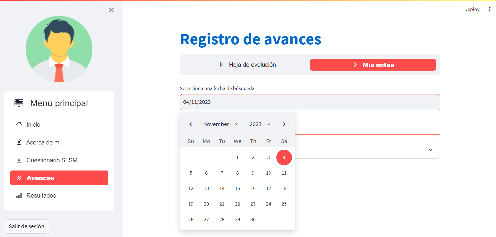   
     
  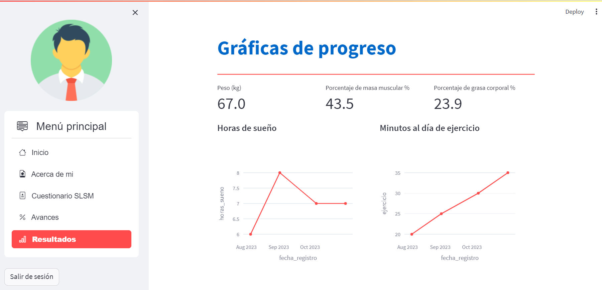   

## 3. Interfaz especialista

  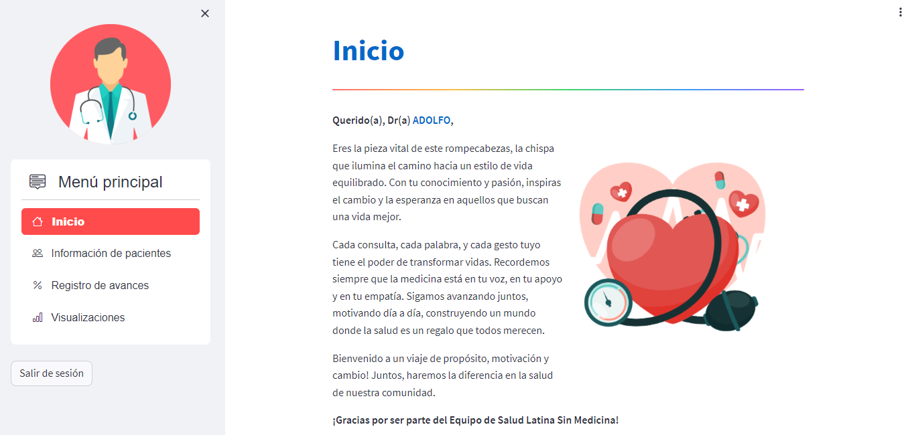   
  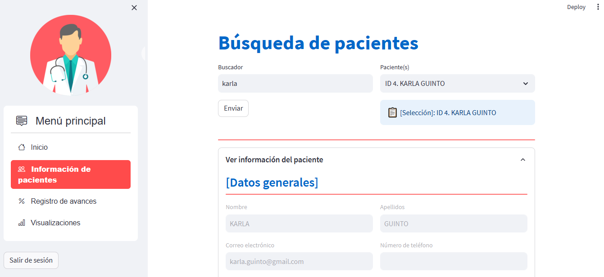   
  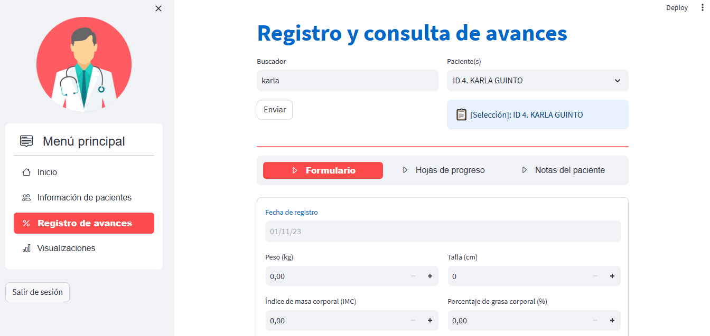   
  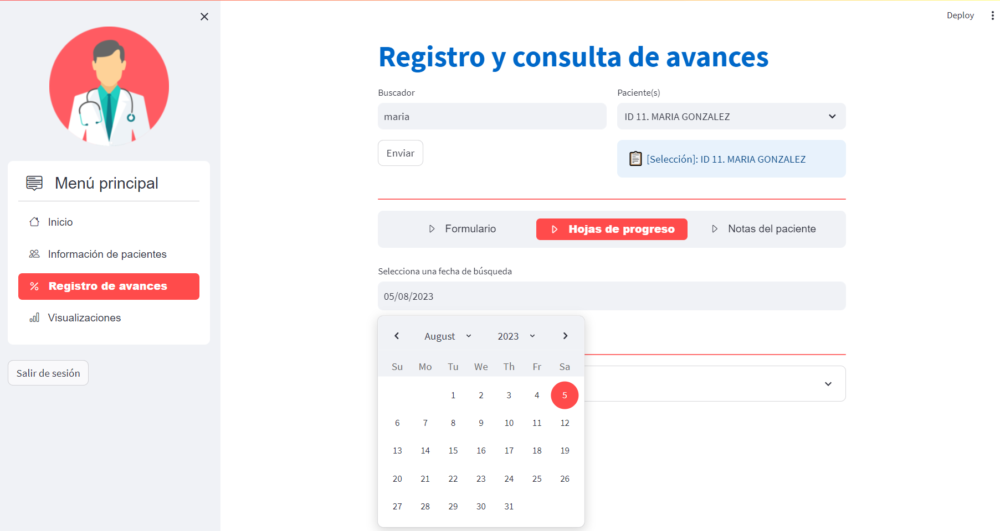   
  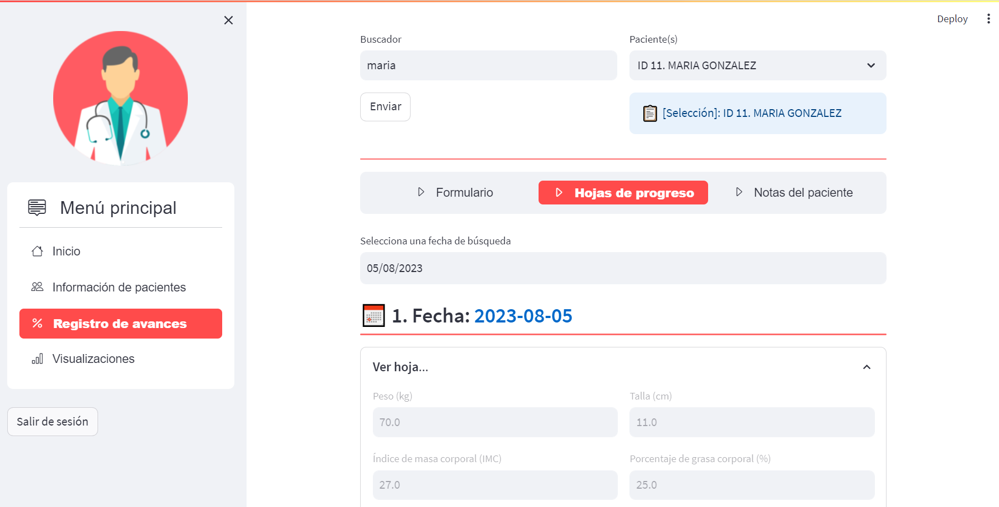   
  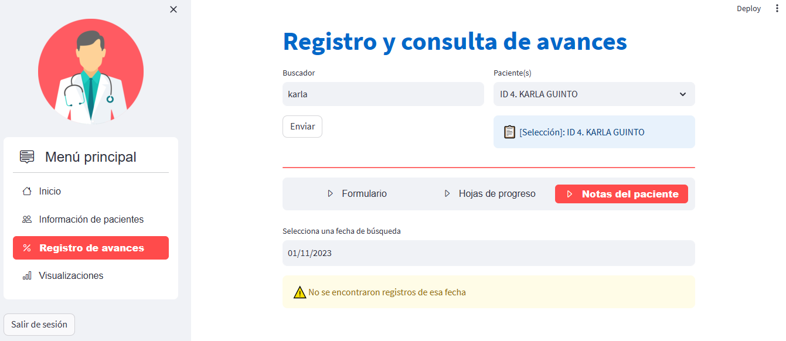   
  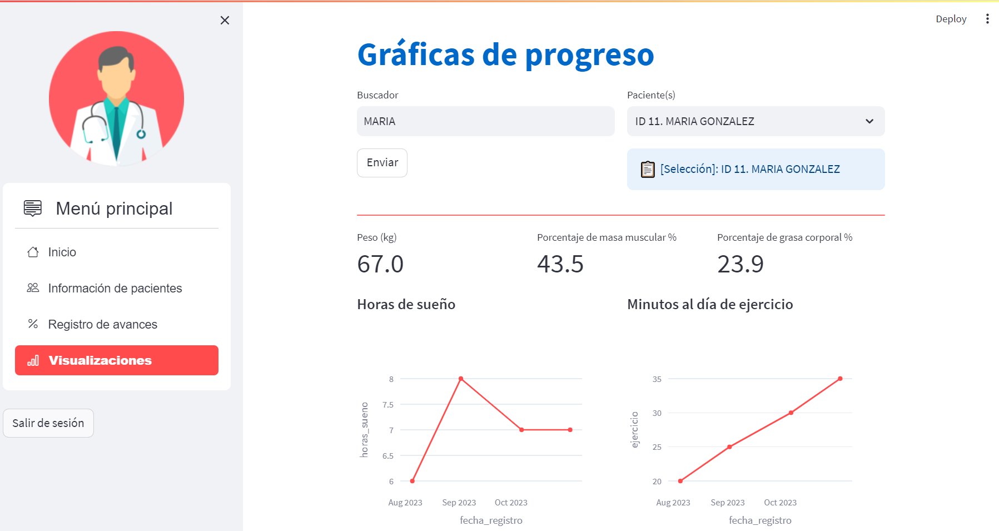   

## 4. Visualización de datos

  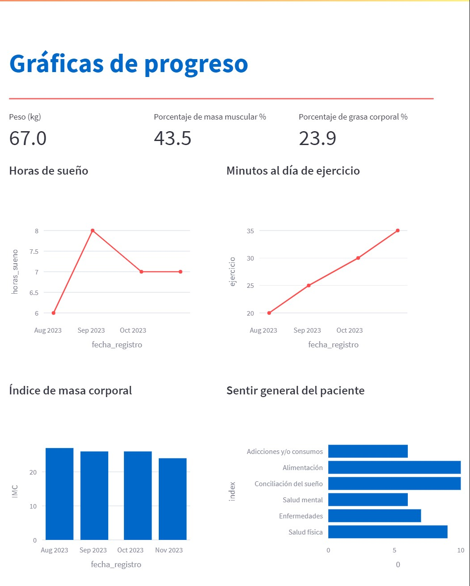   

